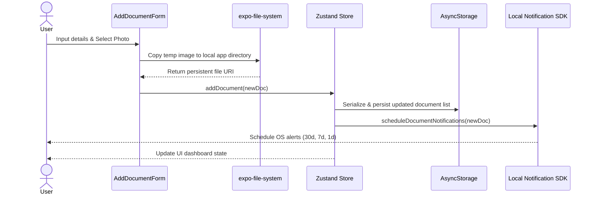
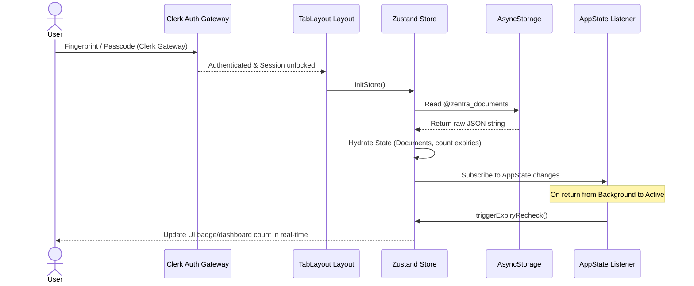
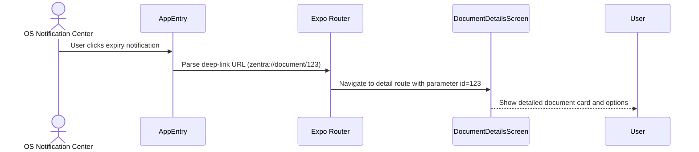
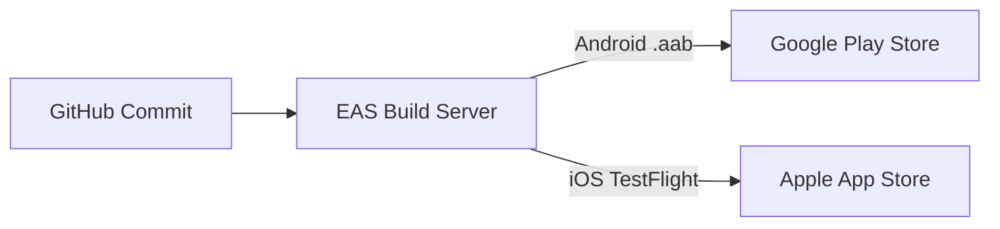

# Zentra System Design Document

This document outlines the technical architecture and system design for **Zentra**, a privacy-first mobile application built with Expo and React Native to track document expiries and manage local notifications.

---

## 1. Clarify Requirements & Scope

Zentra is designed for individuals and businesses who need to track important document expirations (e.g., passports, driver's licenses, contracts, insurance policies) without compromising their data privacy.

### Functional Requirements
- **Local Document CRUD**: Users can add, view, update, and delete document entries.
- **Expiry Date Tracking**: Display active, upcoming, and overdue expiries in a clean dashboard.
- **Categorization**: Group documents by categories (e.g., ID, Finance, Vehicle, Medical, Custom).
- **On-Device Alerts**: Automatically trigger push/local notifications at user-defined intervals (e.g., 30 days, 7 days, 1 day prior).
- **Local File Attachments**: Users can attach photos or PDFs of documents stored strictly on their device.
- **Search & Filters**: Quick search and category-based filtering on the dashboard.

### Non-Functional Requirements
- **Privacy-First (Zero Cloud Sync)**: Absolutely no document data, file contents, dates, or user profiles are sent to external servers. All operations happen client-side.
- **Off-Grid Reliability**: The core features of the app must work 100% offline.
- **Low Footprint**: Minimal storage utilization and memory usage. File attachments must be handled efficiently to prevent device storage bloat.
- **Reliable Local Scheduling**: Ensure OS-level app termination does not prevent expiry notifications from triggering.
- **Responsive UI**: Instant interaction states using Zustand and local storage.

### Constraints
- **Storage Limits**: Standard AsyncStorage allows ~6MB on Android by default (though expandable) and has a system limit on iOS. We must avoid storing base64 file data directly in AsyncStorage.
- **Notification Queue Limits**: iOS restricts scheduled local notifications to a maximum of 64 per application.
- **Expo Managed Workflow**: Constrained to API capabilities offered by Expo and compatible React Native native modules.

### Out of Scope
- Cloud synchronization, cross-device sharing, or remote backup servers.
- AI OCR/Document scanner automation (all details are entered manually).
- Multi-user collaboration.

---

## 2. Back-of-the-Envelope Estimation

Let's bind our architecture decisions to data and hardware realities on mobile.

### Storage Projections
A typical heavy user is estimated to store up to **100 documents**. Let's calculate the size:

$$\text{Document Metadata Size} \approx 1\text{ KB (text, category, dates, settings)}$$
$$\text{Total Metadata for 100 Docs} \approx 100\text{ KB}$$

AsyncStorage is a key-value store stored as a serialized JSON string. Hydrating a 100 KB JSON string into Zustand on startup takes **< 5ms**, which is negligible.

### File Attachment Storage
If a user attaches an image or PDF to each of their 100 documents:
- Avg compressed image size: **1.5 MB**
- Total local storage usage: **150 MB**
- **Decision**: Storing these files as Base64 strings in AsyncStorage would crash the app due to memory overhead and storage limits. We must store the raw files in the application's local Documents Directory using `expo-file-system` and only store the file path URIs (strings) in AsyncStorage.

### Notification Triggers
If a user has 50 documents, and each document has **3 scheduled alerts** (e.g., 30 days, 7 days, 1 day before expiry):
- Total scheduled notification triggers = $50 \times 3 = 150$ triggers.
- **Constraint**: iOS enforces a hard limit of **64 local notifications**.
- **Decision**: The scheduling coordinator must truncate the queue to only schedule the **top 50 closest triggers** chronologically, re-calculating and replenishing the queue every time the app is opened or a document is updated.

---

## 3. High-Level Architecture

The system topology is completely self-contained within the user's mobile device, except for Clerk, which acts as a biometric/identity gate to open the application.

```mermaid
graph TD
    subgraph Mobile Device (Sandbox)
        User[User Interface] --> UIComponents[React Native & NativeWind Components]
        UIComponents --> Routes[Expo Router /app]
        Routes --> Store[Zustand Stores /store]
        
        subgraph Data Layer
            Store -->|Hydration/Persistence| Storage[AsyncStorage Key-Value]
            Store -->|File Handlers| FileSystem[expo-file-system /Documents]
        end

        subgraph Background Services
            Store -->|Local Alerts Coordinator| Notifications[Expo Notifications SDK]
            Notifications -->|Schedules| OSNotifications[iOS/Android OS Notification Center]
        end
    end

    subgraph External Cloud
        Clerk[Clerk Auth Gateway] -.->|OAuth / Identity Gate Only| Routes
    end
    
    style ExternalCloud fill:#f9f,stroke:#333,stroke-width:2px
    style Data Layer fill:#bbf,stroke:#333,stroke-width:2px
```

---

## 4. Data Model & Storage Design

### Key-Value Storage Schema (AsyncStorage)

We use two primary AsyncStorage keys:
1. `@zentra_documents`: Array of Document objects.
2. `@zentra_user_profile`: Basic user profile settings (theme preference, custom notification offsets).

### TypeScript Interface (`types/document.ts`)

```typescript
export interface Document {
  id: string;                      // UUID v4
  name: string;                    // User-defined title
  category: DocumentCategory;      // Union of predefined categories
  expiryDate: string;              // ISO-8601 string (YYYY-MM-DD)
  createdAt: string;              // ISO-8601 string timestamp
  updatedAt: string;              // ISO-8601 string timestamp
  notificationsEnabled: boolean;   // Toggle for notifications
  customAlertDays: number[];       // Offsets in days (e.g., [30, 7, 1])
  notes?: string;                  // Optional user notes
  fileUri?: string;                // URI pointing to local FileSystem.documentDirectory
  fileType?: string;               // MIME type (e.g., 'image/jpeg', 'application/pdf')
}

export type DocumentCategory = 'ID' | 'Finance' | 'Vehicle' | 'Medical' | 'Utilities' | 'Other';
```

### Physical File Organization
All attachments are copied to the application's secure documents folder:
`FileSystem.documentDirectory + 'attachments/${documentId}.${fileExtension}'`

---

## 5. API & Communication Patterns

Since Zentra is local-first, we do not communicate with external REST or gRPC APIs for document details. The "APIs" are local utility interfaces that decouple components from side effects.

### A. Notification Coordinator Interface (`lib/notifications.ts`)
```typescript
interface NotificationCoordinator {
  // Syncs and schedules local OS notifications for a given document list
  syncAllNotifications(documents: Document[]): Promise<void>;
  
  // Explicitly schedule triggers for a single document
  scheduleDocumentNotifications(doc: Document): Promise<string[]>;
  
  // Cancel all triggers associated with a single document
  cancelDocumentNotifications(docId: string): Promise<void>;
  
  // Requests permissions from the OS
  requestPermissions(): Promise<boolean>;
}
```

### B. Date & Expiry Utilities (`lib/date.ts`)
```typescript
interface DateCalculator {
  getDaysUntilExpiry(expiryDateString: string): number;
  isExpired(expiryDateString: string): boolean;
  isUpcoming(expiryDateString: string, thresholdDays: number): boolean;
  formatRelativeDate(days: number): string;
  sortByExpiry(documents: Document[], order: 'asc' | 'desc'): Document[];
}
```

---

## 6. Data Flow Examples

### Journey 1: Add Document (Happy Path)



### Journey 2: App Launch and Refresh Flow



### Journey 3: Notification Click Handling (Deep Link)



---

## 7. Deep Dive into Critical Components

### Critical Problem 1: Local Notification Truncation and Queue Refill
Both iOS and Android limit the number of active scheduled notifications. If Zentra users exceed the limit, alerts could be silently missed.

**Solution**: Priority-based scheduling coordinator.
When scheduling, Zentra evaluates all upcoming notification dates across all documents. It compiles a flat list of trigger events:
```typescript
interface NotificationTrigger {
  documentId: string;
  triggerDate: Date;
  message: string;
}
```
1. Filter out triggers in the past.
2. Sort the triggers in ascending order (closest first).
3. Slice the list to the **first 48 triggers** (leaving some buffer slots).
4. Cancel all currently scheduled OS notifications.
5. Register the sliced list with `Notifications.scheduleNotificationAsync`.
6. Set a background sync check to rerun this slice-and-replenish routine whenever the app is foregrounded.

### Critical Problem 2: Secure File Sandboxing & Native Storage Limits
Storing raw documents (scanned PDFs/images) in native AsyncStorage causes app crashes, long boot times, and memory leaks because the entire key-value DB is parsed into RAM during hydration.

**Solution**: Decoupled File System Architecture.
- AsyncStorage holds document schemas containing a string field `fileUri`.
- Files are saved to `FileSystem.documentDirectory` which is automatically backed up by standard OS backups (unless excluded) and is persistent.
- When deleting a document, Zentra must trigger a deletion hook in `expo-file-system` to prevent orphaned files from cluttering disk space.

---

## 8. Event-Driven & Integration Patterns

### Application Lifecycle Integration
Because document dates change in real-time but the database remains static while the app is closed, Zentra listens to `AppState` changes:

```typescript
import { AppState, AppStateStatus } from 'react-native';

AppState.addEventListener('change', (nextAppState: AppStateStatus) => {
  if (nextAppState === 'active') {
    // 1. Re-calculate relative days (e.g. "expires today")
    useDocumentStore.getState().recalculateExpirations();
    // 2. Replenish notification queue to account for time elapsed
    useDocumentStore.getState().refreshNotificationQueue();
  }
});
```

---

## 9. Trade-offs & Architecture Decision Records (ADRs)

### ADR 1: Local Storage Strategy
* **Context**: We need to store document metadata locally. Options: AsyncStorage vs. SQLite.
* **Decision**: AsyncStorage.
* **Rationale**: AsyncStorage is simple, natively supported in Expo out of the box, and fits our low-footprint constraint (total JSON size under 1MB). Using SQLite introduces database migration overhead and larger bundle sizes without a functional requirement for complex relational queries.
* **Consequences**: No SQL query support. Filtering and sorting must be done in-memory via JavaScript array methods, which is extremely fast for under 1,000 items.

### ADR 2: Notification Management Strategy
* **Context**: Users need notifications before document expiry. Options: Push Notifications (Server-sent) vs. Local Notifications.
* **Decision**: Local Notifications.
* **Rationale**: Privacy-first mandate requires zero exposure of document details or dates to external servers. Local notifications schedule directly on the device calendar subsystem.
* **Consequences**: Triggers cannot be dynamically adjusted by a server. Adjustments require the user to open the app to reschedule.

### ADR 3: File Attachment Handling
* **Context**: Where to store attached images/PDFs. Options: Base64 in AsyncStorage vs. Filesystem.
* **Decision**: Local Filesystem (`expo-file-system`).
* **Rationale**: Avoids memory constraints and performance degradation of AsyncStorage.
* **Consequences**: We must manually sync file deletion when metadata is deleted to prevent orphaned files.

---

## 10. Scalability & Performance Optimization

### UI Performance (Dashboard Render Optimization)
If the user accumulates 100+ documents, rendering them in a standard ScrollView causes layout lag.
- **Optimization**: Use React Native's `FlatList` with `initialNumToRender={10}` and `windowSize={5}` to recycle views.
- **Zustand Selectors**: Implement selector hooks `useDocuments(id => id)` to avoid re-rendering entire cards when only a single item's notification configuration toggles.

---

## 11. Resilience & Disaster Recovery

### Preventing OS Cache Cleanups
On mobile OSs (especially iOS), items stored in the temporary `cacheDirectory` can be wiped out at any time if system storage is low.
- **Resilience**: Zentra guarantees that file attachments are stored exclusively in the `documentDirectory`, which iOS/Android promise to leave untouched during cache purges.

### User Backup & Local Recovery
Since there is no cloud database, device loss means data loss.
- **Disaster Recovery Strategy**: Zentra provides a "Backup & Restore" setting.
  - **Export**: Zzip/JSON archive of all documents + attachments is generated locally using `expo-file-system` and shared using `expo-sharing` (enabling users to save it to their iCloud Drive, Google Drive, or send it to themselves via email securely).
  - **Import**: Users can select this Zentra backup file, unpack it, and restore their database state 100% locally.

---

## 12. Security & Threat Modeling

```
+-------------------------------------------------------------+
|                     Threat Matrix                           |
+--------------------------+----------------------------------+
| Threat                   | Mitigation Strategy              |
+--------------------------+----------------------------------+
| Device Theft/Snooping    | Biometric Gate (Clerk Screen)    |
| Other Apps Reading DB    | iOS/Android Sandbox Isolation    |
| Cleartext Metadata Leak  | Optional Secure Store Encryption |
+--------------------------+----------------------------------+
```

### Encryption at Rest (Optional Extension)
If user metadata requires bank-grade local security:
- Sensitive fields (e.g., specific document identifiers, passport numbers in notes) can be stored using `expo-secure-store`, which utilizes Keychain services (iOS) and Keystore (Android).
- Standard metadata (names, categories, expiry dates) is kept in standard AsyncStorage to maintain list-sorting performance.

### Clerk Identity Protection
- Clerk handles login and provides a secure JWT token session.
- Document data is decoupled from Clerk. We only check if the user is authenticated; we do not send document data to Clerk metadata fields.

---

## 13. Observability & DevOps

### Local Telemetry
- To respect the privacy policy, Zentra has **zero external analytics** (no Firebase Analytics, no Amplitude).
- Diagnostic logs are written to a local rolling file. If a bug occurs, users can optionally export their diagnostic logs file to send to developers manually (contains system details and errors, zero document names or dates).

### Deployment Pipeline (EAS)


---

## 14. Testing Architecture

### Unit Testing
- Test suite targeting `lib/date.ts` to verify timezone differences, leap years, and accurate day counts.
- Test suite targeting Zustand store CRUD operations using simulated AsyncStorage mocks.

### E2E Testing (Maestro)
We use Maestro for automated local mobile testing because it requires no node dependencies and is extremely fast.
```yaml
# maestro/add_document.yaml
appId: com.zentra.app
---
- launchApp
- tapOn: "Add Document"
- inputText: "My Passport"
- tapOn: "Category"
- tapOn: "ID"
- tapOn: "Save"
- assertVisible: "My Passport"
```

---

## 15. Cost Estimation

Zentra's local-first architecture yields near-zero operating costs:

| Component | Technology | Cost per 100K Users | Rationale |
|---|---|---|---|
| **Database** | AsyncStorage | $0.00 | Local device storage |
| **Storage** | expo-file-system | $0.00 | Local device storage |
| **Authentication** | Clerk | $0.00 (Free Tier) | Clerk free tier supports up to 10k MAUs. Paid starts at $25/mo |
| **Push Notifications** | Expo Notifications | $0.00 | Local Scheduling uses zero server bandwidth |
| **Analytics/Logs** | Local Storage | $0.00 | Zero server logging |
| **Total** | | **$0.00 / month** | Scaling is completely free for Zentra |

---

## 16. Evolution Roadmap & Pre-flight Checklist

### Schema Migration (Zustand Persist)
When updates require new fields in the `Document` schema (e.g., adding `isOverdue` flag or `archived` state):
- Zustand persist middleware handles migrations via its `version` configuration:
```typescript
migrate: (persistedState: any, version: number) => {
  if (version === 0) {
    // Perform migrations from version 0 to 1
    persistedState.documents = persistedState.documents.map((doc: any) => ({
      ...doc,
      archived: false, // New field addition
    }));
  }
  return persistedState;
}
```

### Pre-flight Checklist
- [ ] Verify AsyncStorage size bounds are guarded (no base64 files in JSON).
- [ ] Confirm Clerk config handles sign-outs cleanly by flushing user state from memory.
- [ ] Verify notification count limit handles truncation at exactly 48 items gracefully.
- [ ] Confirm no cloud endpoints or trackers exist in the configuration.
- [ ] Verify AppState foreground triggers perform an immediate date-fns calculations update.
